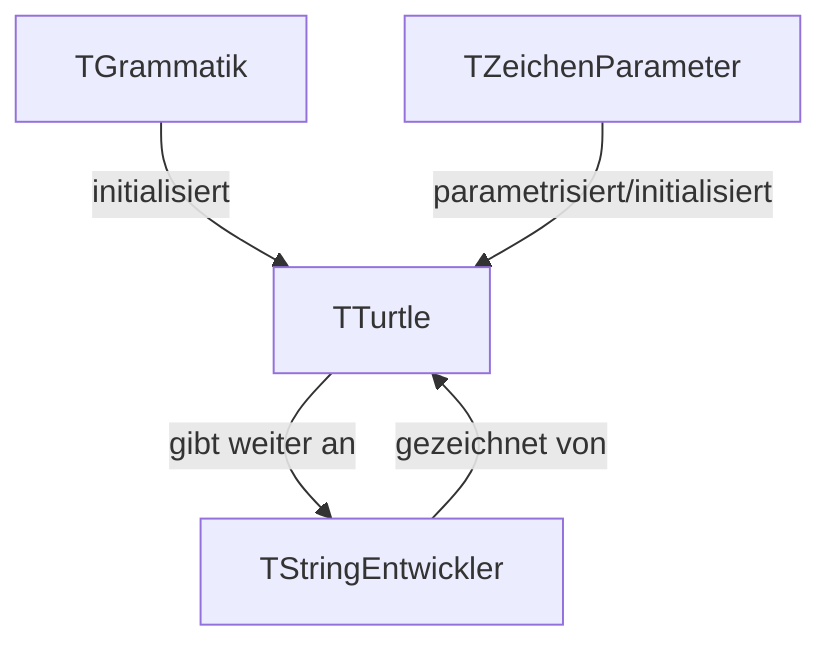

# L-Systeme in 3D

## Zum belesen
Bevor man L-Systeme implementiert sollte man sich zuerst einmal belesen. Hierzu ist dieses 
[Dokument](https://www.yumpu.com/de/document/read/18849596/l-systeme-und-andere-kunstliche-pflanzen) sehr zu empfehlen.

## Frontend
Das Frontend ist nach dem Ausführen und ausprobieren des Programms relativ selbst erklärend.

## Backend
Hier werden die wesentlichen Strukturen des Backend beschrieben.

### Grammatik-Struktur (TGrammatik)
Diese Klasse speichert unsere Definition der Grammatik, welche folgendermassen aufgebaut ist:

    record: Grammatik
      axiom: String;
      regeln: TFPGMap<Char,String>;

Noch zu ergänzen:
  - wenn man Zufälligkeiten reinbringen will, muss man den Datentyp des Wertes umdefinieren
    - eine Liste aus Wahrscheinlichkeit und Produktion wäre denkbar

### Turtle-Struktur (TTurtle)
Die Turtle-Klasse ist dafür verantwortlich das L-System überhaupt zu Zeichnen. Diese wird mit einer Grammatik 
und mehreren "Zeichen Parametern" initialisiert. Die Grammatik ist während der Lebenszeit der Turtle nicht 
veränderbar, die "Zeichen Parameter" jedoch schon. Grober Aufbau der Zeichen Parameter:

    record: ZeichenParameter
      winkel: Real;
      Rekursions-Tiefe: (unsigned) Cardinal;
      startPunkt: TPunk3D;
      Zeichenart: TZeichenart; // wird erst spaeter eingefuegt

Die Turtle-Klasse sieht für grob folgendermassen aus:

    class: Turtle
      Feld: Grammatik (read only);
      Feld: ZeichenParameter (read und write (mit getter Funktionen));
      Feld: StringEntwickler (zustaendig fuer das erstellen der strings);
      constructor: Create;
        Parameter 1: Grammatik;
        Parameter 2: Zeichenparameter;
      procedure: zeichnen;

Noch zu ergänzen:
  - verschiedene "Zeichenstile" möglich machen (verschiedene Farben...)

### Entwickeln der Strings (TStringEntwickler)
Das Entwickeln der Strings wird von dem "StringEndwickler" gehandhabt. Diese wird mit einer Grammatik initialisiert, 
welche während der Laufzeit der initialisierten Instanz nicht geändert werden kann. Beim Entwickeln des Strings kann man 
als Parameter die Rekursionstiefe angeben:

    class: StringEntwickler
      Feld: Grammatik (read only);
      Feld: String (Endwickelter String);
      constructor: Create;
        Parameter 1: Grammatik;
      procedure: entwickeln;
        Parameter 1: Cardinal (rekursionsTiefe);

Noch zu ergänzen:
  - Zufälligkeit
    - Überlegung: Bewältigen mit dem bilden der Präfixsummen von Wahrscheinlichkeitswerten. Diese werden dann mit binärer Suche Abgefragt.
  - (vllt) Optimierungen
    - der Algorithmus kann mit dynamischer Programmierung optimiert werden
    - Überlegung: Unter Verwendung von Bit-Magie und dynamischer Programmierung könnte eventuell sogar eine logarithmische Laufzeit erzielt werden. (Ist eine Ueberlegung wert)

### Grafisch dargestellt

